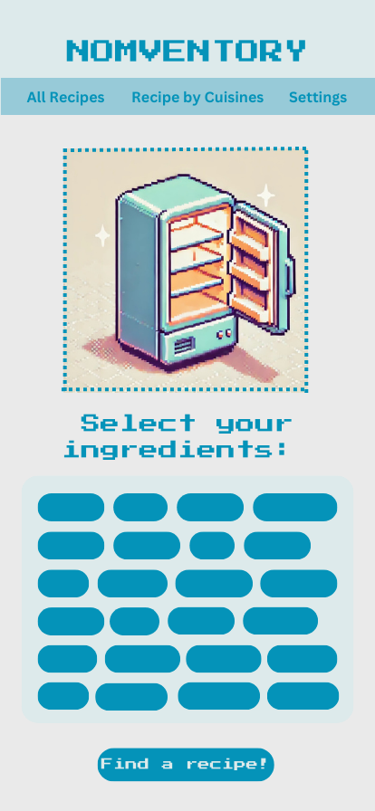
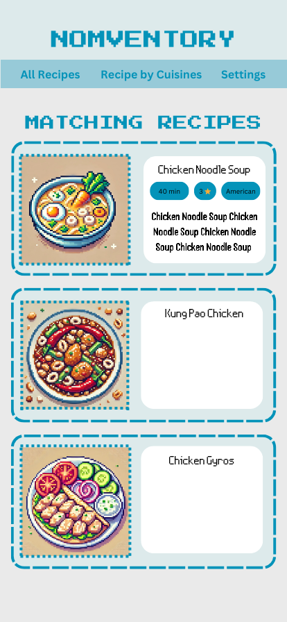

# Project Title

Nomventory - Capstone Project Proposal

## Overview

What is your app? Give a brief description in a couple of sentences.

Nomventory is a web application that helps users find recipes based on ingredients they already have at home. By selecting available ingredients, users will receive a list of matching recipes. The platform will also include a filtering system to allow for filtering by cuisine, or to accomodate dietary restrictions. Designed with a fun and immersive pixel-art cooking game aesthetic, Nomventory will leverage AI-generated images that match in theme to enhance the user experience.

### Problem Space

Why is your app needed? Give any background information around any pain points or other reasons.

Many people struggle with meal planning due to limited knowledge of recipes that they can cook with the ingredients they already have at home. They often buy ingredients for one recipe, and end up with leftover ingredients, that end up going bad in their fridge or pantry. As a result, they may resort to ordering takeout and wasting food.

Nomventory aims to address this problem by providing personalized recipe suggestions based on avaialble ingredients, helping users make the most of what they have and inspire them to cook more.

### User Profile

Who will use your app? How will they use it? Add any special considerations that your app must take into account.

Nomventory is designed for:

- Home cooks looking for meal inspiration
- Busy individuals who want to quickly find recipes without needing to shop for additional ingredients
- People with dietary restrictions, allergies, or strong food preferences
- Beginners who want an engaging and gamified cooking experience.

Users will interact with the app by:

- Selecting ingredients from their fridge or pantry
- Filtering out unwanted ingredients due to allergies or preference
- Filtering by their preferred cuisine type
- Viewing a curated list of recipes that match their selection
- Exploring a visually appealing website, featuring cute pixel-art generated by AI

### Features

List the functionality that your app will include. These can be written as user stories or descriptions with related details. Do not describe _how_ these features are implemented, only _what_ needs to be implemented.

#### Ingredient Selection:

- Users can select ingredients they have available at home

#### Recipe Matching:

- The system will suggest recipes based on the selected ingredients

#### Filter System:

- Users can exclude specific ingredients due to allergies or preferences

#### Cuisine Integration:

- Users can explore recipes categorized by different cuisines

#### Recipe Details:

- Each recipe will display ingredients, instructions, cook time, difficulty level, and the AI generated image

#### Dynamic Recipe Expansion:

- The database will start with 30 recipes, with the potential to grow overtime (maybe even before I submit it!).

#### Gamified Experience:

- The UI will be designed to feel fun and engaging, resembling a cooking game

## Implementation

### Tech Stack

List technologies that will be used in your app, including any libraries to save time or provide more functionality. Be sure to research any potential limitations.

#### Frontend:

- React, Javascript, SCSS

#### Backend:

- Express.js, Node.js

#### Database:

- MySQL, Knex.js

#### Image Generation:

- ChatGPT

### APIs

List any external sources of data that will be used in your app.

- None will be used, I will build my own database and server.

### Sitemap

List the pages of your app with brief descriptions. You can show this visually, or write it out.

- Home Page: Welcome page and ingredient selection
- Recipe Results Page: List of suggested recipes in card form
- Recipe Details Page: Full recipe with detailed ingredients and instructions
- Cuisine Page: Browse recipes by cuisine type
- Settings Page: User preference, allergies, and dietary filters

### Mockups

Provide visuals of your app's screens. You can use pictures of hand-drawn sketches, or wireframing tools like Figma.

### Data

Describe your data and the relationships between the data points. You can show this visually using diagrams, or write it out.

- Lucidchart
- Sketch
- Draw.io

#### Recipes

- Recipe ID
- Recipe Name
- Description
- Difficulty Level
- Instructions
- Cook time
- Servings
- Cuisine_id (one to many)
- Image_url

#### Ingredients

- Ingredient ID
- Ingredient Name
- Category

#### Categories

- Category ID
- Category Name

#### Recipe_Ingredients

- ID
- Recipe_id
- Ingredient_id
- Quantity

#### Cuisine

- Cuisine ID
- Cuisine Name

### Endpoints

List endpoints that your server will implement, including HTTP methods, parameters, and example responses.

- GET /ingredients Fetch list of available ingredients
- POST /filter - Send user-selected ingredients and filters
- GET /recipes Retrieve matching recipes
- GET /recipes/:id Fetch detailed recipe info
- GET /cuisines Retrieve list of available cuisines
- GET /cuisines/:id/recipes Fetch recipes by cuisine type

## Roadmap

Scope your project as a sprint. Break down the tasks that will need to be completed and map out timeframes for implementation working back from the capstone due date.

1. Finalize proposal and project plan (1 day)
2. Setup database schema and backend API (2 days)
3. Implement Ingredient Selection UI (1 day)
4. Develop recipe matching logic and filtering system (1 day)
5. Integrate cuisine database and implement cuisine filtering (1 day)
6. Refine front end design and styling (1 day)
7. Conduct testing & debugging. Practice for presentation (1 day)
8. Deliver Presentation

---

## Future Implementations

Your project will be marked based on what you committed to in the above document. Here, you can list any additional features you may complete after the MVP of your application is built, or if you have extra time before the Capstone due date.

- User Accounts: To save user preferences and ingredients with authentication
- Expanded Recipe Database: For real world practical use
- % Ingredients Matched: Implement a system to inform users what percentage of ingredients for a recipe they already own
- Fridge & Pantry Expiry: Stored data with expiry dates of ingredients
- Shopping List Generator: Suggest missing ingredients for recipes and build a shopping list
- Social Features: Users to be able to like and comment on recipes
- Gamification Enhancements: Unlockable achievements, prizes, animations for completing recipes, or by using the app a certain number of days in a row.
